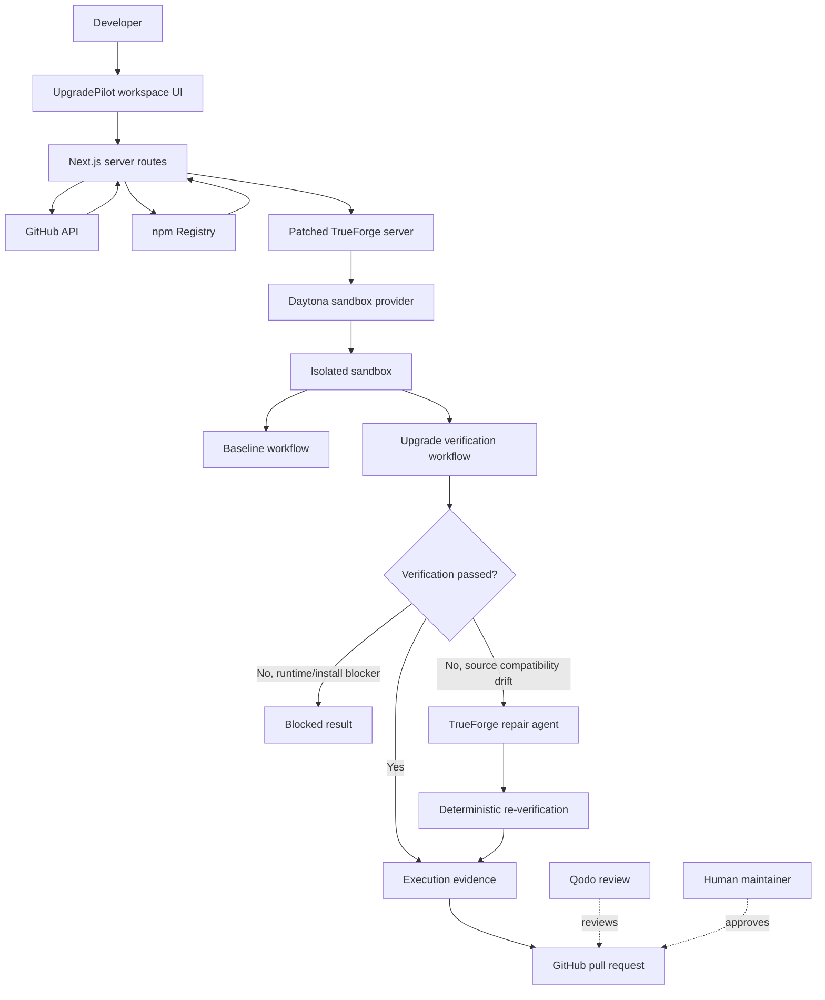

# UpgradePilot

UpgradePilot helps developers upgrade dependencies with proof, not guesswork.

Give it a public GitHub Node.js repository, and it inspects the dependency inventory, checks what is outdated, establishes the current baseline, applies a selected upgrade in an isolated sandbox, and runs the repository's real verification commands. If the upgrade breaks the project, UpgradePilot can hand the failure evidence to a repair agent, apply a safe fix, re-run verification, and only prepare a pull request when the result is backed by execution evidence.

## Qodo Code Review Evidence

Qodo acted as an independent code-review layer for UpgradePilot. The most useful reviews were not cosmetic; they caught trust-boundary, reliability, and maintainability issues that made the project stronger.

Highlights:

- [PR #16](https://github.com/JAIVIGNESH2002/UpgradePilot/pull/16): made verified repairs trustworthy. Qodo caught cases where `unifiedDiff` repairs could be lost, new repair-created files were not handled in GitHub PR creation, and enrichment failures could silently produce partial PR contents.
- [PR #17](https://github.com/JAIVIGNESH2002/UpgradePilot/pull/17): hardened repository inspection. Qodo flagged private-repository leakage risks, oversized GitHub responses, malformed API contracts, TrueForge timeout coverage, dependency inventory caps, and missing failure-mode tests.
- [PR #18](https://github.com/JAIVIGNESH2002/UpgradePilot/pull/18): tightened TrueForge result parsing. Qodo caught marker-collision risks in command output, kept unrelated dependency-policy changes out of the PR, and found a `{ resultText }` wrapper contract mismatch.
- [PR #19](https://github.com/JAIVIGNESH2002/UpgradePilot/pull/19): bounded run storage. Qodo pushed us to add TTL eviction, max-size retention, stale-running timeouts, active-run limits, stricter env parsing, and clearer full-gate verification evidence.

## What The Agent Does

UpgradePilot guides a dependency upgrade from repository inspection to a verified pull request:

```text
repo -> dependencies -> select upgrade -> sandbox -> baseline -> upgrade -> verify -> repair if needed -> re-verify -> PR
```

Core behavior:

- Inspects public GitHub npm/pnpm repositories.
- Detects package manager, lockfile, runtime requirement, dependencies, devDependencies, scripts, and current resolved versions.
- Fetches latest package versions from the npm registry.
- Runs baseline verification through TrueForge + Daytona with zero model calls.
- Applies selected dependency upgrades in an isolated sandbox.
- Runs deterministic verification commands.
- Invokes the TrueForge repair agent only when verification fails because of upgrade-related source compatibility drift.
- Creates a GitHub pull request only after the upgrade is verified.

## TrueForge Integration

UpgradePilot is the product UI and orchestration layer. TrueForge is the execution and agent harness underneath it.

The deterministic happy path runs through:

```text
UpgradePilot -> TrueForge -> Daytona -> deterministic workflow
```

Baseline verification and passing upgrade verification do not use an LLM. The model path is reserved for repair after a genuine verification failure.

Current TrueForge usage:

- Deterministic sandbox APIs for npm baseline and upgrade verification.
- Daytona as the configured sandbox provider.
- TrueForge agent/session flow for repair handoff after failed verification.
- Explicit environment-based configuration for Daytona and Gemini via `scripts/configure-trueforge.mjs`.

## Architecture



## Tech Stack

- Next.js with the App Router
- TypeScript in strict mode
- Tailwind CSS
- ESLint and Prettier
- Vitest
- Playwright-ready E2E setup
- TrueForge as the sandbox/agent harness
- Daytona as the configured sandbox provider
- Qodo for independent pull request review

## Running The Project

There are two practical ways to run the project.

### UI And Inspection Mode

This mode does not require secrets. It supports the workspace UI, public repository inspection, dependency inventory, and npm registry latest-version lookup.

```bash
npm install
cp .env.example .env.local
npm run dev -- --port 3000
```

Open:

```text
http://localhost:3000
```

### Full Execution Mode

This mode runs real baseline and upgrade verification through TrueForge + Daytona. It requires credentials.

Required:

- A running patched TrueForge server
- Daytona API key
- Optional GitHub token for higher API limits and PR creation
- Optional Gemini key for repair-agent handoff

Start TrueForge locally:

```powershell
cd C:\Users\jaivi\Downloads\trueforge
pnpm standalone:dev
```

Start UpgradePilot:

```powershell
cd C:\Users\jaivi\Documents\ChatGPT\UpgradePilot
npm run dev -- --port 3000
```

Configure TrueForge from your local `.env.local`:

```bash
node --env-file=.env.local scripts/configure-trueforge.mjs
```

## Docker Compose

Docker Compose is the easiest way to share UpgradePilot with other developers.

The TrueForge repository used for this project is a regular local clone with local patches. It is not vendored into UpgradePilot. Build and publish that patched TrueForge image first, then UpgradePilot Compose can pull it.

### 1. Build And Push Patched TrueForge

From the TrueForge clone:

```powershell
cd C:\Users\jaivi\Downloads\trueforge
docker build -f Dockerfile.dev -t jvxdock/trueforget-sandbox-repo:upgradepilot-mvp .
docker push jvxdock/trueforget-sandbox-repo:upgradepilot-mvp
```

Use the exact pushed image in `.env`:

```env
TRUEFORGE_IMAGE=jvxdock/trueforget-sandbox-repo:upgradepilot-mvp
```

### 2. Run UpgradePilot Stack

From this repository:

```bash
cp .env.example .env
docker compose up --build
```

Open:

```text
http://localhost:3000
```

TrueForge is available on:

```text
http://localhost:8790
```

If `.env` has no secrets, the UI and public GitHub inspection can still run. Real sandbox baseline/upgrade verification requires Daytona credentials.

## Environment And Secrets

Never commit `.env`, `.env.local`, GitHub tokens, Gemini keys, Daytona keys, or generated credential files.

Server-side UpgradePilot values:

```env
TRUEFORGE_BASE_URL=http://localhost:8790
GITHUB_TOKEN=
TRUEFORGE_MODEL_NAME=google-gemini/gemini-2.5-flash
```

TrueForge/Daytona values:

```env
DAYTONA_API_KEY=
DAYTONA_API_URL=
DAYTONA_TARGET=
DAYTONA_EXEC_TIMEOUT_MS=600000
DAYTONA_AUTO_STOP_MINUTES=5
DAYTONA_AUTO_ARCHIVE_MINUTES=60
DAYTONA_AUTO_DELETE_MINUTES=7200
```

Repair-agent model values:

```env
GEMINI_API_KEY=
TRUEFORGE_GEMINI_MODEL_ID=gemini-2.5-flash
TRUEFORGE_GEMINI_MODEL_NAME=gemini-2.5-flash
TRUEFORGE_REPAIR_REASONING_EFFORT=low
TRUEFORGE_REPAIR_MAX_TOKENS=2400
TRUEFORGE_REPAIR_ITERATION_LIMIT=5
TRUEFORGE_REPAIR_MIN_INTERVAL_MS=15000
TRUEFORGE_REPAIR_BACKOFF_MS=15000
```

`GITHUB_TOKEN` is used only by UpgradePilot server routes for GitHub API calls and PR creation. It is never required in browser code.

`DAYTONA_API_KEY` and `GEMINI_API_KEY` are passed to the TrueForge configure helper. They are not baked into Docker images.

## Configure TrueForge From Env

The helper script waits for TrueForge and configures:

- Daytona sandbox provider when `DAYTONA_API_KEY` is set
- Google Gemini model provider when `GEMINI_API_KEY` is set

For Docker Compose this runs automatically as the `trueforge-configure` service.

For local development, run it after TrueForge starts:

```bash
node --env-file=.env.local scripts/configure-trueforge.mjs
```

The script does not print secret values.

## Quality Checks

Run the same checks used by CI:

```bash
npm run format:check
npm run lint
npm run typecheck
npm run test
npm run build
npm run e2e
```

## Product Scope

UpgradePilot currently targets Node.js dependency upgrades for GitHub repositories.

The MVP intentionally does not implement broad ecosystem support, vulnerability scanning, package recommendation ranking, automatic merging, billing, or account management.

Do not treat model output as proof. Success requires real execution evidence from baseline and post-upgrade verification.
